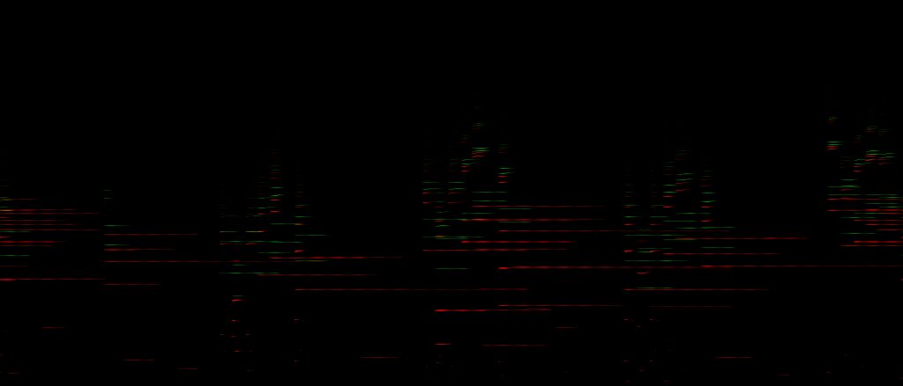

# SPlayer

A spectogram player for [Fragment](https://www.fsynth.com)

This gather any images element with CSS class "hplayer" and build a player out of it, the covnerted sound can be downloaded as WAV.

The player use additive synthesis with a [logarithmic map](https://www.fsynth.com/documentation/ui/) to convert the image to sounds, granular synthesis method is planned.

The player can be be integrated on forums, websites etc. to provide sharing of scores or sounds produced with those tools, alternatively, the player can be used to convert any images to sounds by drag'n'dropping the image onto a player with the enabled feature.

It is compatible with most image-synth such as [Virtual ANS](http://warmplace.ru/soft/ans/) and [MetaSynth](http://uisoftware.com/MetaSynth/)

#### Features

- WAV download
- PNG download
- Customizable
- Fast, use Web Workers to convert images to sounds asynchronously, dispatch tasks depending on physical core count
- Basic transport features, play/pause/stop and continuous seek by clicking on the image
- Magnifying tool
- Gain level selection
- Drag'n'drop to convert any images to sounds
- Small size library

#### Usage

There is a minified up to date ready-to-use js file in the **dist** folder, you will also need the worker folder in the **dist** directory and the **data/player** directory for the icons, to use the entire library, just include `splayer.min.js` in your HTML file, see the example.

```html
<link rel="stylesheet" type="text/css" href="dist/splayer.min.css"/>
<script type="text/javascript" src="dist/splayer.min.js"></script>
```

The library was built with a Python [custom build tool](https://github.com/grz0zrg/pynut) which look for `/*#include file.js*/` , include it and produce a production-ready minified file, the build file is called **pynutbuild**, nutbuild  file is for a more advanced personal live build system.

##### Documentation

A player is automatically created on all images tags with a class `hplayer` when `SPlayer.apply` function is called, example :

```js
window.onload = function () {
    SPlayer.apply();
};
```

The player is individually customizable by passing parameters as data attributes, example :

```html

```

Here is a list of all parameters :

```javascript
    _known_options = {
        width: 400, // width of the player
        height: 200, // height of the player
        
        octaves: 10, // octaves range (used to map frequencies)
        baseFrequency: 16.34, // first frequency
        
        gainBarSideMargin: 1, // control the look of the container of the volume bars
        gainContainerWidth: 16, // control the look of the container of the volume bars
        gainContainerHeight: 12, // control the look of the container of the volume bars
        gainLevel: 1, // the initial volume level (1 = default volume, up to gainLevels)
        gainLevels: 3, // how much volume levels can be chosen
        
        acceptDrop: true, // wether the player accept drag'n'drop of images files
        acceptDownload: true, // wether the player allow to download the WAV file
        
        sps: 60, // "FPS"/slices per seconds, this is the rate of the playback
        
        gain: 1.5, // the default volume
        gainMultiplier: 0.5, // the volume multiplier (gain * (1.0 + gainMultiplier)) used by each volume levels
        
        backgroundColor: "#000000" // HTML hex/rgb color or "transparent"
    },
```
##### Credits

This use [spin.js](http://spin.js.org/) [FileSaver.js](https://github.com/eligrey/FileSaver.js/) [WUI](https://github.com/grz0zrg/wui) and [Recorderjs](https://github.com/mattdiamond/Recorderjs) library

##### License

Contact me for any commercial usage